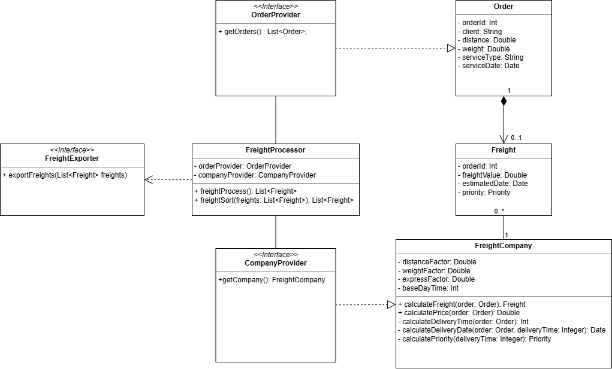

[](https://classroom.github.com/a/RBBavBFg)

# Calculadora de Frete

## Visão Geral
Sistema de cálculo de frete **orientado a dados**, projetado para processar pedidos com base em uma **companhia de frete configurada**.

## Objetivo
Receber:
- Configuração de uma companhia de frete
- Lista de pedidos pendentes

Retornar:
- Valor de frete para cada pedido
- Resultados ordenados por prioridade
- Com data estimada de entrega

## Modelagem Conceitual
A modelagem foi estruturada para refletir diretamente o contexto da aplicação e o formato dos dados de entrada.

### Diagrama de Classes



### Order
Representa a unidade de entrada do sistema.

**Responsabilidades:**
- Armazenar dados relevantes (distância, peso, tipo de serviço, etc.)
- Servir como base para o cálculo de frete

### Freight Company
Representa uma estratégia de cálculo aplicada aos pedidos.

**Responsabilidades:**
- Interpretar configurações
- Aplicar regras específicas de cálculo
- Definir:
  - Valor do frete
  - Prazo de entrega
  - Restrições operacionais

### Freight
Representa o resultado do processamento.

**Responsabilidades:**
- Representar o resultado do cálculo para um pedido
- Referenciar a companhia responsável pelo cálculo
- Armazenar:
  - Valor calculado
  - Prazo de entrega
  - Prioridade

## Fluxo do Sistema

1. Dados são obtidos a partir de fontes externas
2. Pedidos e a companhia são disponibilizados ao sistema
3. Um componente de cálculo processa os pedidos:
   - Aplica a companhia configurada a cada pedido
   - Gera resultados válidos
4. Os resultados são organizados:
   - Por prioridade
   - Por data de entrega
5. A resposta é retornada

## Padrão Arquitetural
O projeto segue o padrão **MVC (Model-View-Controller)**, conforme definido na proposta.

- **Model**: representa o contexto (`Pedido`, `CompanhiaFrete`, `Frete`)
- **Controller**: recebe entradas e aciona o processamento
- **View**: representa os resultados

## Estrutura do Projeto

```
src/main/java/br/edu/ufrgs
 ├── model
 │    ├── Order
 │    ├── Freight
 │    └── FreightCompany
 │
 ├── service
 │    └── FreightProcessor
 │
 ├── provider
 │    ├── OrderProvider
 │    └── CompanyProvider
 │
 ├── exporter
 │    └── FreightExporter
 │
 ├── controller
 │    └── (Servlets)
 │
 └── webapp
      └── webview
```

## Abstração de Dados

O sistema utiliza interfaces para desacoplar a origem dos dados do processamento:

- `OrderProvider`: fornece pedidos ao sistema
- `CompanyProvider`: fornece a companhia configurada
- `FreightProvider`: fornece a lista de fretes ordenada

Essa abordagem permite flexibilidade na origem dos dados, como arquivos CSV, APIs ou outras fontes externas.

## Regras de Negócio

- Cada companhia define seus próprios parâmetros de cálculo
- Um pedido pode gerar uma opção de frete, dependendo das restrições da companhia
- Uma companhia só gera resultado se atender às restrições do pedido
- Os resultados são ordenados por:
  1. Prioridade
  2. Data de entrega

## Entrada de Dados

O sistema trabalha com dados estruturados, como:

- Configuração de companhia de frete
- Pedidos pendentes

Esses dados podem ser fornecidos por diferentes fontes.

## Possíveis Extensões

- Suporte a múltiplos formatos de dados
- Integração com serviços externos
- Persistência de resultados

## Autoria

João Victor Prado Trindade, 588129 ; Jorge Antônio Noll, 343372 ; Arthur Farias Zapata, 577298 ; Pedro Henrique Antunes Claudino, 579557.
